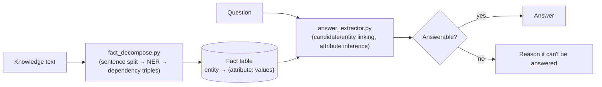

<div align="center">

# hallucination-detector

**A fact-decomposition and answer-extraction pipeline — no LLM involved.**

Feed it a passage and a question; it shows *exactly* how it got to the answer,
step by step, or tells you honestly when it can't.

[](https://www.python.org/)
[](https://fastapi.tiangolo.com/)
[](https://spacy.io/)

**[🚀 Live demo](https://hallucination-detector-tbv5.onrender.com)**

</div>

---

## What it does

Given a block of **knowledge** text and a **question**, the pipeline:

1. Decomposes the text into structured facts (who did what, with what attributes).
2. Parses the question to figure out what's being asked and what it's being compared against.
3. Answers it — or explicitly reports **"not answerable"** with the reason, rather than guessing.

Nothing here is hand-coded per sentence or question. It's all generic dependency-tree walking and named-entity recognition via spaCy, so the same logic handles any input text.

## How it works



| Stage | File | Responsibility |
|---|---|---|
| **Decompose** | `fact_decompose.py` | Splits text into sentences → clauses. Walks each clause's dependency tree into generic *(subject, predicate, object)* triples. Runs NER and attaches typed spans (`DATE`, `GPE`, `ORG`, ...) to the triples they appear in. Rolls everything into a fact table: `entity → {attribute_type: [values]}`. |
| **Answer** | `answer_extractor.py` | Handles two question shapes:<br>• **Comparison** ("X or Y...") — splits the candidates, infers the needed attribute from the comparator word (e.g. *"founded"* → `DATE`), fuzzy-links each candidate to the fact table, and picks the min/max.<br>• **Direct** ("When was X renovated?") — fuzzy-links the question's entity, matches the question's predicate against that entity's individual triples (so *"built in 1999"* isn't confused with *"renovated in 2000"*), and reads off the answer. |
| **API** | `server.py` | FastAPI backend (`POST /api/analyze`) that re-runs the pipeline and returns *every* intermediate value — entities, triples, linking scores, inferred attribute types — not just the final answer. |
| **UI** | `static/index.html` | Renders each pipeline stage as a step-through visualization. |

## Quickstart

```bash
pip install -r requirements.txt
python server.py
```

Then open **http://127.0.0.1:8008**.
